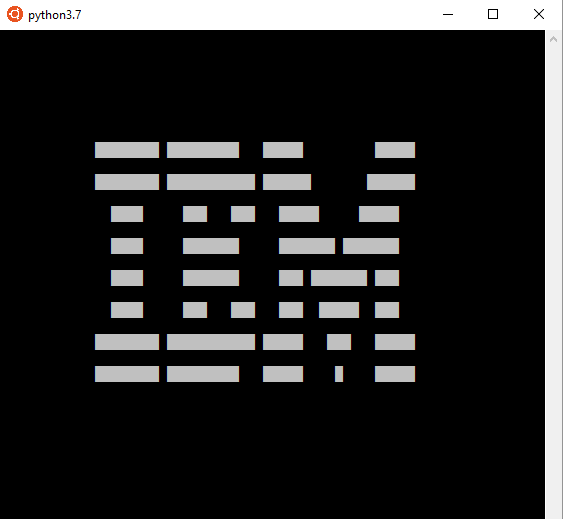

# chip8-emu
Chip8 emulator in Python 3.7

This is a Chip8 emulator for Python 3.7. I wrote it to learn a little bit about curses and also try out dataclasses for Python 3.7; they reminded me of structs. I've also been curious about writing an emulator for a long time.

TODO:
  * Input is almost done. I think.
  * Curses error handling. It will crash if the terminal is not large enough (32x64) and not reset properly.



Usage:

```sh
$ python3.7 main.py <romname in ./roms/>
```

```sh
$ python3.7 main.py ibm
```
